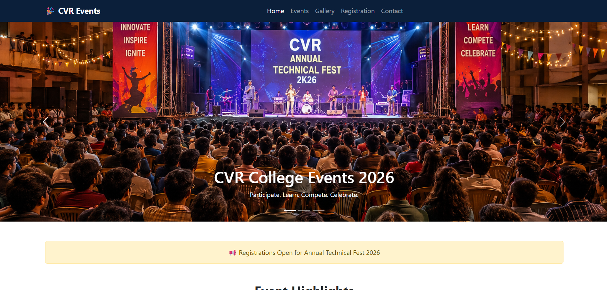
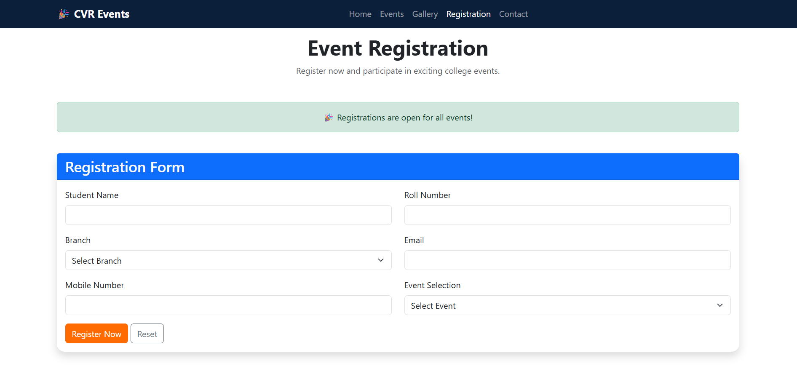
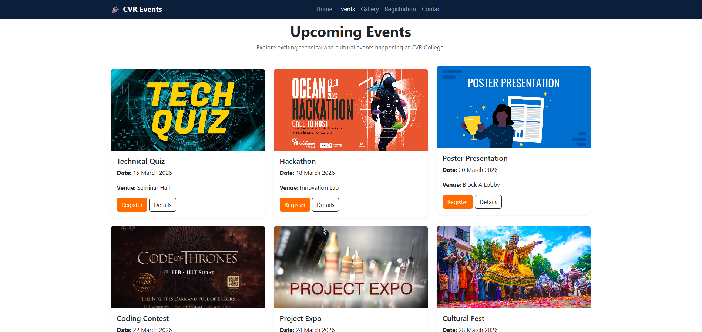
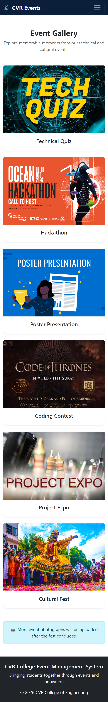

# 🎉 College Event Management System

A responsive web application developed using **HTML, CSS, and Bootstrap 5** to manage college events efficiently. The system allows students to explore upcoming events, register for participation, view event schedules, browse event galleries, and contact event coordinators.

---

## 📌 Project Overview

The **College Event Management System** is designed to provide an interactive platform for students to participate in various technical and cultural events conducted at **CVR College of Engineering**. The website offers a user-friendly interface with responsive layouts to ensure seamless accessibility across mobile, tablet, and desktop devices.

---

## 🚀 Features

### 🏠 Home Page
- Responsive Navigation Bar
- Bootstrap Carousel
- Event Highlights Section
- Statistics Cards
- Registration Call-to-Action
- Announcements using Alerts

### 🎭 Events Page
- Display of 6 Upcoming Events:
  - Technical Quiz
  - Hackathon
  - Poster Presentation
  - Coding Contest
  - Project Expo
  - Cultural Fest
- Event Cards with Images
- Event Date and Venue Information
- Registration Buttons
- Event Details using Bootstrap Modals

### 📝 Event Registration
- Student Registration Form
- Fields Included:
  - Student Name
  - Roll Number
  - Branch
  - Email
  - Mobile Number
  - Event Selection
- Success Modal after Registration
- Form Validation using HTML5

### 📅 Event Schedule
- Responsive Schedule Table
- Bootstrap Table Components:
  - Table
  - Table-striped
  - Table-hover
- Status Badges
- Event Notifications using Alerts

### 🖼️ Gallery
- Responsive Image Gallery
- Event Photographs displayed using Cards
- Grid Layout

### ❓ FAQ
- Frequently Asked Questions
- Bootstrap Accordion Component

### 📞 Contact
- Contact Form
- Event Coordinator Details
- Social Media Links
- Bootstrap Alerts

---

## 🛠️ Technologies Used

- HTML5
- CSS3
- Bootstrap 5.3.7
- Bootstrap Components:
  - Navbar
  - Carousel
  - Cards
  - Forms
  - Tables
  - Accordion
  - Alerts
  - Buttons
  - Grid System
  - Modal
  - Badges

---

## 📱 Responsive Design

The website is designed to be responsive across various devices:

### Mobile (<576px)
- Single-column layouts
- Collapsible Navbar

### Tablet (≥768px)
- Two-column layouts where applicable

### Desktop (≥992px)
- Multi-column layouts

---

## 📂 Project Structure

```

college-event-management/
│
├── index.html
├── events.html
├── registration.html
├── schedule.html
├── gallery.html
├── faq.html
├── contact.html
│
├── css/
│   └── style.css
│
├── images/
│   ├── carousel1.png
│   ├── carousel2.png
│   ├── carousel3.png
│   ├── h1.jpg
│   ├── h2.jpg
│   ├── quiz.jpg
│   ├── poster.jpg
│   ├── expo.jpg
│   ├── h3.jpg
│   
└── README.md

```

---

## 📸 Screenshots

### 🏠 Home Page



### 📝 Registration Form



### 📅 Event Schedule Page



### 📱 Mobile View



---

## 🔗 GitHub Repository

Repository Link:

```
https://github.com/Bhanu-prasad-1706/FSD/tree/main/College%20Event%20Management%20System
```


---

## 🎯 Learning Outcomes

- Developed a multi-page responsive web application.
- Utilized Bootstrap 5 components effectively.
- Implemented responsive layouts using Grid System.
- Created user-friendly forms and tables.
- Improved Git and GitHub workflow through regular commits.

---

## 👨‍💻 Author

**Bhanu Prasad**

CVR College of Engineering

---

## 📄 License

This project is developed for educational purposes as part of the Front-End Development coursework.