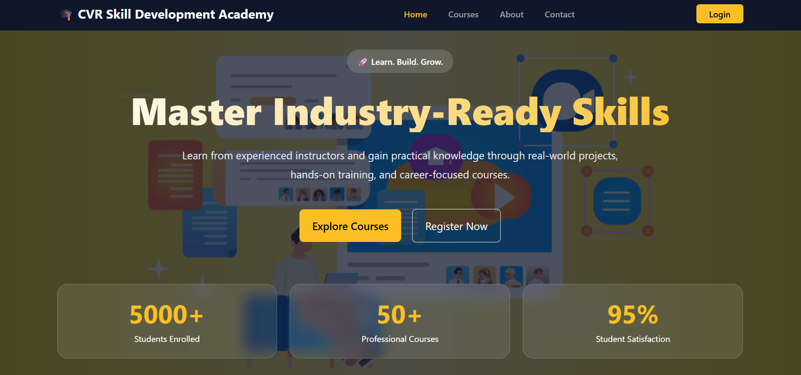
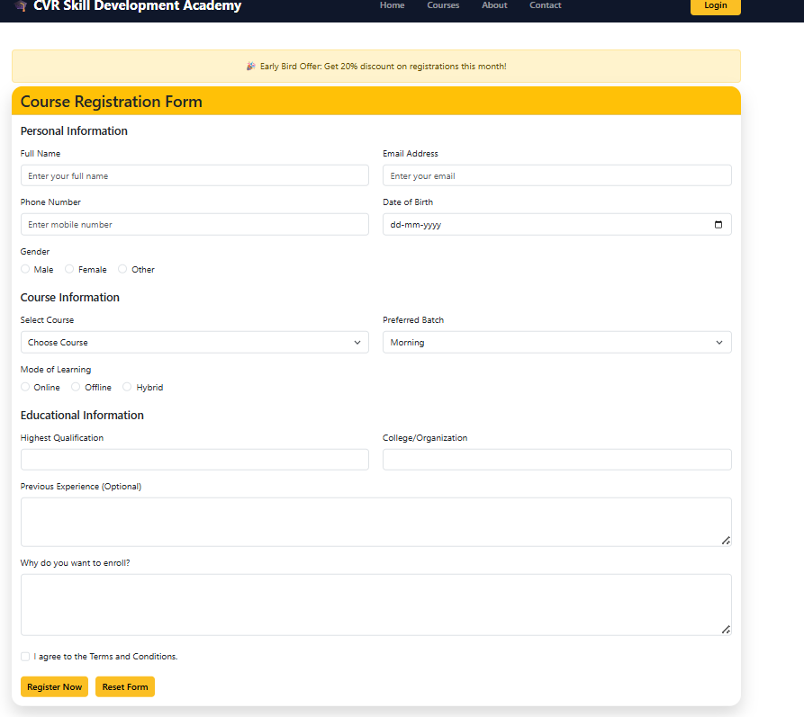
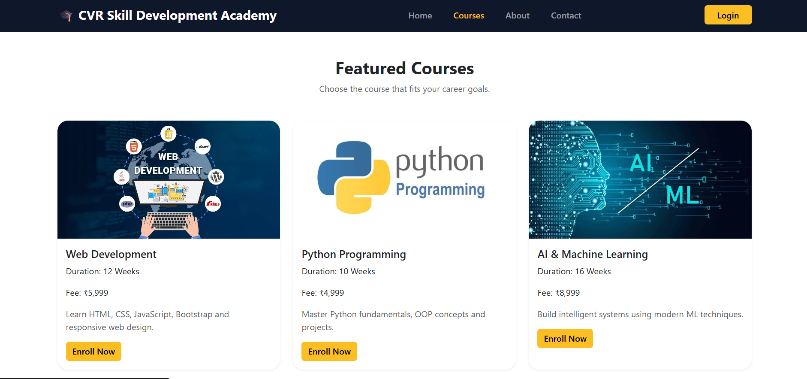
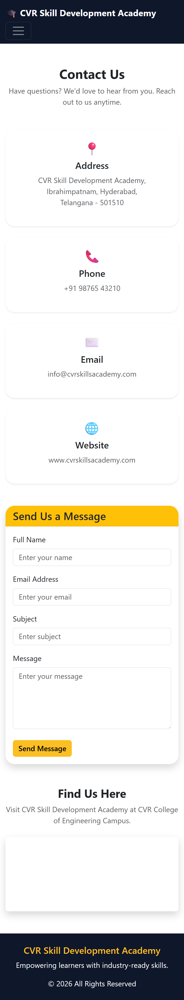

# 🎓 Online Course Registration Portal

A responsive web application developed using **HTML, CSS, and Bootstrap 5** that allows students to explore available courses and register online. The portal provides course details, institute information, registration facilities, and contact information through a user-friendly interface.

---

## 📌 Project Overview

The **Online Course Registration Portal** is designed for **CVR Skill Development Academy** to help students browse professional training programs and enroll in courses conveniently. The website follows responsive design principles to ensure compatibility across mobile, tablet, and desktop devices.

---

## 🚀 Features

### 🏠 Home Page
- Responsive Navigation Bar
- Hero Section with Background Image
- Institute Introduction
- Explore Courses Button
- Featured Courses Section
- Student Testimonials
- Footer with Contact Information

### 📚 Courses Page
Display of available courses:
- Web Development
- Python Programming
- Data Science
- AI & Machine Learning
- Java Programming
- Cloud Computing

Each course card includes:
- Course Image
- Course Name
- Duration
- Fee Details
- View Details Button

### 📝 Registration Page
Online course registration form with:
- Student Name
- Email Address
- Mobile Number
- Gender
- Course Selection
- Qualification
- Address
- Upload Resume
- Terms & Conditions Checkbox

Features:
- Form Validation
- Success Alert after Registration

### ℹ️ About Us Page
Includes:
- Institute History
- Mission
- Vision
- Faculty Details using Bootstrap Cards

### 📞 Contact Us Page
Includes:
- Contact Form
- Google Maps Integration
- Institute Address Information
- Contact Details

---

## 🛠️ Technologies Used

- HTML5
- CSS3
- Bootstrap 5.3.7

### Bootstrap Components Used
- Navbar
- Carousel
- Cards
- Forms
- Buttons
- Alerts
- Modal
- Grid System
- Accordion
- Tables

---

## 📱 Responsive Design

The website is optimized for multiple screen sizes.

### Mobile (<576px)
- Single-column layouts
- Collapsible Navbar

### Tablet (≥768px)
- Two-column layouts where applicable

### Desktop (≥992px)
- Multi-column layouts

---

## 📂 Project Structure

```

online-course-registration-portal/
│
├── index.html
├── courses.html
├── registration.html
├── about.html
├── contact.html
│
├── css/
│   └── style.css
│
├── images/
│   ├── 1.jpg
│   ├── web.jpg
│   ├── python.jpg
│   ├── ds.jpg
│   ├── aiml.jpg
│   ├── java.jpg
│   ├── cc.jpg
│   ├── t1.jpg
│   ├── t2.jpg
│   └── t3.jpg
│
└── README.md

```

---

## 📸 Screenshots

### 🏠 Home Page



### 📝 Registration Form



### 📚 Courses Page


### 📞 Contact Page


---

## 🔗 GitHub Repository

Repository Link:

```
https://github.com/Bhanu-prasad-1706/FSD/tree/main/Online%20Course%20Registration%20portal

```

---

## 🎯 Learning Outcomes

- Developed a responsive multi-page web application.
- Implemented Bootstrap 5 components effectively.
- Designed user-friendly registration forms.
- Enhanced understanding of responsive web design.
- Practiced Git and GitHub version control workflows.

---

## 👨‍💻 Author

**Bhanu Prasad**

CVR College of Engineering

---

## 📄 License

This project is developed for educational purposes as part of the Front-End Development coursework.
```
